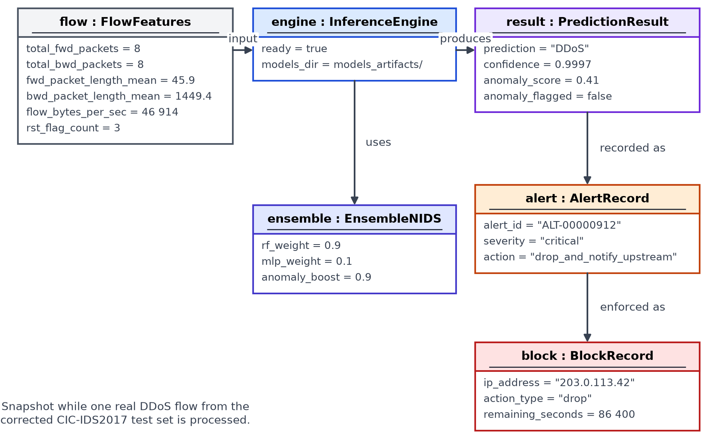
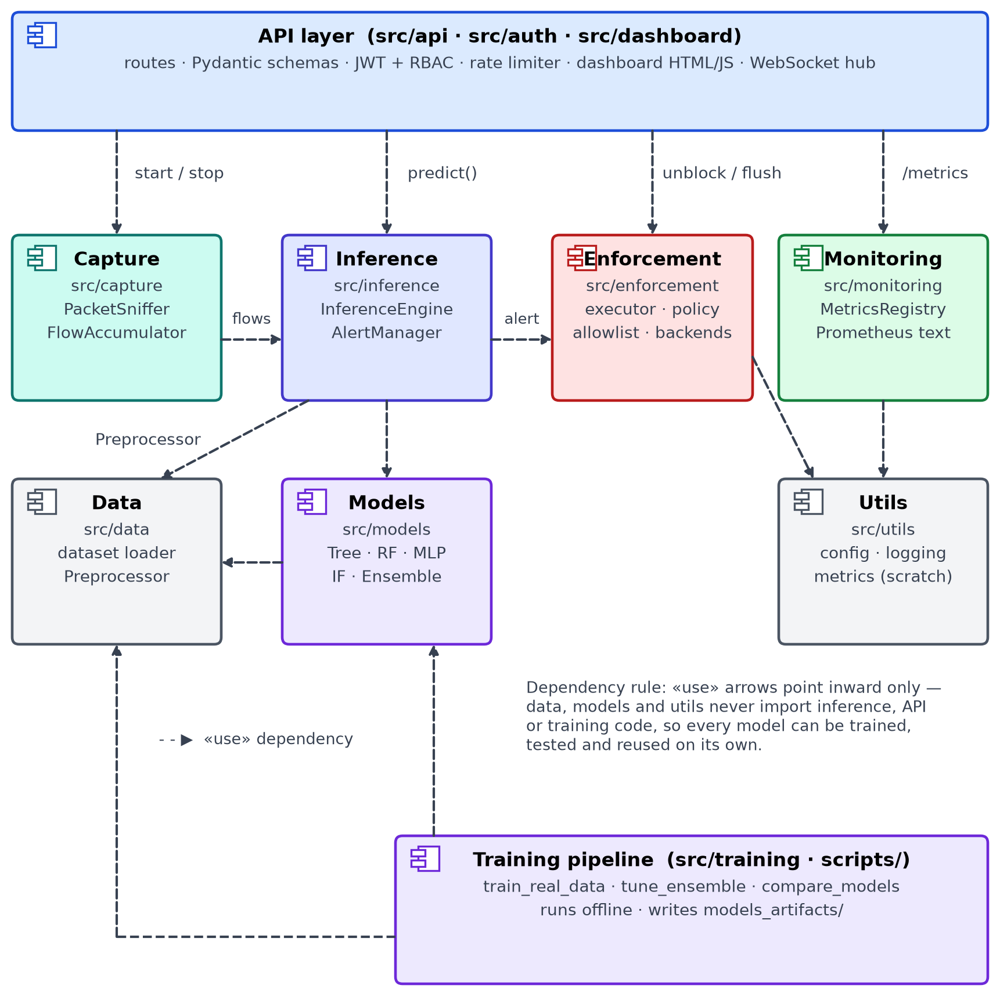
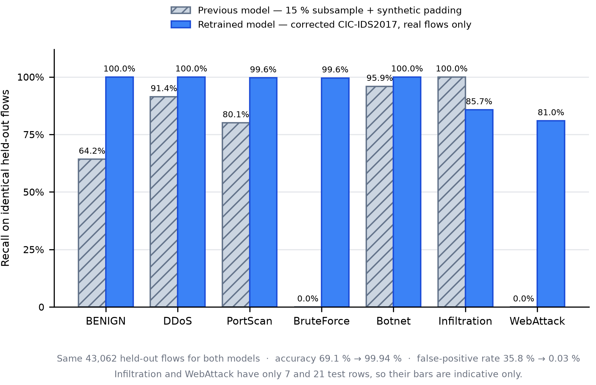

[INSTITUTION / UNIVERSITY NAME]

[Faculty / Department Name]

\

\

\

::: {custom-style="CoverTitle"}
NIDS — A Machine-Learning Based Network Intrusion Detection and Prevention System
:::

\

A PROJECT REPORT

\

Submitted in partial fulfillment of the requirements for the degree of
Bachelor in Computer Application (BCA)

\

Course Code: CACS452 — Project III

\

\

**Submitted by:**

[Student Name 1] — [Roll No.]

[Student Name 2] — [Roll No.]

\

**Submitted to:**

[Supervisor Name]

[Department Name]

\

[Month, Year]

```{=openxml}
<w:p><w:pPr><w:sectPr><w:type w:val="nextPage"/><w:pgSz w:w="11906" w:h="16838"/><w:pgMar w:top="1440" w:right="1440" w:bottom="1440" w:left="1800" w:header="720" w:footer="720" w:gutter="0"/><w:cols w:space="720"/><w:docGrid w:linePitch="360"/></w:sectPr></w:pPr></w:p>
```

::: {custom-style="FrontHeading"}
Supervisor's Recommendation
:::

I hereby recommend that this project report prepared under my supervision by **[Student Name 1]** and **[Student Name 2]**, entitled **"NIDS — A Machine-Learning Based Network Intrusion Detection and Prevention System"**, be accepted as fulfilling in part the requirements for the degree of Bachelor in Computer Application. In my opinion, the work is satisfactory and is ready for evaluation.

\

\

\

………………………………………

**[Supervisor Name]**

Supervisor

[Department Name]

[Institution Name]

```{=openxml}
<w:p><w:r><w:br w:type="page"/></w:r></w:p>
```

::: {custom-style="FrontHeading"}
Letter of Approval
:::

This is to certify that this project report prepared by **[Student Name 1]** and **[Student Name 2]**, entitled **"NIDS — A Machine-Learning Based Network Intrusion Detection and Prevention System"**, in partial fulfillment of the requirements for the degree of Bachelor in Computer Application, has been evaluated by the internal and external examiners. In our opinion it is satisfactory in the scope and quality as a project for the required degree.

\

\

………………………………………  ………………………………………

**[Supervisor Name]**     **[Internal Examiner Name]**

Supervisor          Internal Examiner

\

\

………………………………………  ………………………………………

**[HoD / Coordinator Name]**   **[External Examiner Name]**

HoD / Coordinator        External Examiner

```{=openxml}
<w:p><w:r><w:br w:type="page"/></w:r></w:p>
```

# Acknowledgement

We thank our supervisor, **[Supervisor Name]**, for the guidance and feedback that shaped this project, and the Head and faculty of the **[Department Name]** for the academic foundation and resources that made it possible.

We also acknowledge the researchers whose published algorithms and datasets this work builds on — in particular the Canadian Institute for Cybersecurity for the CIC-IDS2017 dataset and the DistriNet group at KU Leuven for its corrected re-extraction — and the open-source community whose tools supported the engineering of the system.

Finally, we thank our families and friends for their patience and encouragement throughout the development of NIDS.

```{=openxml}
<w:p><w:r><w:br w:type="page"/></w:r></w:p>
```

# Abstract

Signature-based defences cannot recognise attacks they have not seen before, and machine-learning detectors that only exist inside a notebook cannot protect a network. **NIDS** (Network Intrusion Detection System; implemented as the code base *NetSentry*) is a complete intrusion detection system with an optional prevention mode. It captures live packets from a network interface, aggregates them into bidirectional flows described by thirty statistical features, and classifies every flow as benign or as one of six attack types — DDoS, Port Scan, Brute Force, Botnet, Infiltration or Web Attack. Every learning algorithm is implemented from first principles in NumPy: a Random Forest and a Multi-Layer Perceptron recognise known attack patterns, an Isolation Forest flags never-before-seen behaviour, and an ensemble layer fuses them with a weighted vote and an anomaly-override rule. Around the detector the project delivers a REST API, an operator dashboard with a real-time WebSocket feed, severity-ranked alerting, a policy-driven enforcement layer that can rate-limit or block attacking addresses, Prometheus metrics, and a from-scratch JWT authentication layer with two roles.

The models were trained on the corrected CIC-IDS2017 dataset (Liu, Engelen et al., 2022) using real flows only — 215,307 deduplicated flows after class capping — and evaluated on a stratified held-out split of 43,062 flows. The ensemble reached 99.94 % accuracy, a macro-averaged F1-score of 97.3 %, a false-positive rate of 0.03 % and a detection rate of 99.86 %, at 0.5 ms per flow. Re-scoring the project's earlier model, which had been trained on a 15 % subsample padded with synthetic rows, on the same held-out flows gave 69.1 % accuracy and a 35.8 % false-positive rate; the comparison shows that data provenance, not model complexity, decided detection quality. A further contribution is a live feature extractor that reproduces the CICFlowMeter conventions of the training data exactly, so that the model behaves on captured traffic the way it behaves on the benchmark.

**Keywords:** Network Intrusion Detection, Machine Learning, Random Forest, Neural Network, Isolation Forest, Ensemble Learning, CIC-IDS2017, Live Packet Capture, Intrusion Prevention, Role-Based Access Control.

```{=openxml}
<w:p><w:r><w:br w:type="page"/></w:r></w:p>
```

::: {custom-style="FrontHeading"}
Table of Contents
:::

```{=openxml}
<w:p><w:r><w:fldChar w:fldCharType="begin" w:dirty="true"/></w:r><w:r><w:instrText xml:space="preserve"> TOC \o "1-3" \h \z \u </w:instrText></w:r><w:r><w:fldChar w:fldCharType="separate"/></w:r><w:r><w:t xml:space="preserve">Right-click and choose Update Field (or press F9) to build the table of contents.</w:t></w:r><w:r><w:fldChar w:fldCharType="end"/></w:r></w:p>
```

```{=openxml}
<w:p><w:r><w:br w:type="page"/></w:r></w:p>
```

# List of Abbreviations

| Abbreviation | Full Form |
| --- | --- |
| API | Application Programming Interface |
| AUC | Area Under the (ROC) Curve |
| CIC-IDS2017 | Canadian Institute for Cybersecurity – Intrusion Detection System dataset, 2017 |
| CIDR | Classless Inter-Domain Routing (network prefix notation) |
| CSV | Comma-Separated Values |
| DDoS | Distributed Denial of Service |
| DR | Detection Rate (share of attack flows flagged as attacks) |
| F1 | F1-Score (harmonic mean of precision and recall) |
| FIN / SYN / RST / ACK / PSH / URG | TCP control flags |
| FPR | False-Positive Rate (share of benign flows flagged as attacks) |
| HMAC | Hash-based Message Authentication Code |
| HTTP / HTTPS | Hypertext Transfer Protocol (Secure) |
| IAT | Inter-Arrival Time between packets |
| IDS / IPS | Intrusion Detection / Prevention System |
| JSON | JavaScript Object Notation |
| JWT | JSON Web Token |
| MLP | Multi-Layer Perceptron |
| NIC | Network Interface Card |
| OOB | Out-Of-Bag (Random Forest validation estimate) |
| PBKDF2 | Password-Based Key Derivation Function 2 |
| RBAC | Role-Based Access Control |
| REST | Representational State Transfer |
| ROC | Receiver Operating Characteristic |
| SOC | Security Operations Centre |
| TCP / UDP | Transmission Control / User Datagram Protocol |
| TLS | Transport Layer Security |
| TTL | Time To Live (duration of a block) |
| UML | Unified Modeling Language |
| WS / WSS | WebSocket (Secure) |

```{=openxml}
<w:p><w:r><w:br w:type="page"/></w:r></w:p>
```

# List of Figures

| Figure | Title |
| --- | --- |
| Figure 3.1 | Use Case Diagram of NIDS |
| Figure 3.2 | Gantt Chart of the Project Schedule |
| Figure 3.3 | Class Diagram of the Core Modules |
| Figure 3.4 | Object Diagram of a Detection Scenario |
| Figure 3.5 | State Diagram of a Source Address under Enforcement |
| Figure 3.6 | Sequence Diagram of a Prediction Request |
| Figure 3.7 | Activity Diagram of Detection and Enforcement |
| Figure 3.8 | Overall System Architecture of NIDS |
| Figure 3.9 | Component Diagram of NIDS |
| Figure 3.10 | Deployment Diagram of NIDS |
| Figure 4.1 | Ensemble Confusion Matrix on the Held-Out Test Split |
| Figure 4.2 | Per-Class Recall of the Previous and the Retrained Model |
| Figure B.1 | Login Page of the Operator Dashboard |
| Figure B.2 | Operator Dashboard — Pipeline Counters and Live Traffic Monitor |
| Figure B.3 | Operator Dashboard — Threat Breakdown, Blocked IPs and Top Source IPs |
| Figure B.4 | Interactive API Documentation |

# List of Tables

| Table | Title |
| --- | --- |
| Table 3.1 | Use Case Descriptions |
| Table 3.2 | Enforcement Policy per Attack Class |
| Table 3.3 | Non-Functional Requirements |
| Table 3.4 | Role-Based Access Control Matrix |
| Table 3.5 | Live Feature Extraction Rules Mirrored from CICFlowMeter |
| Table 4.1 | Tools and Technologies Used |
| Table 4.2 | Unit Test Cases |
| Table 4.3 | System / Integration Test Cases |
| Table 4.4 | Composition of the Training Data |
| Table 4.5 | Overall Model Performance on the Test Split |
| Table 4.6 | Per-Class Performance of the Ensemble Model |
| Table 4.7 | Previous versus Retrained Model on Identical Held-Out Flows |

```{=openxml}
<w:p><w:pPr><w:sectPr><w:footerReference w:type="default" r:id="rIdftr1"/><w:type w:val="nextPage"/><w:pgSz w:w="11906" w:h="16838"/><w:pgMar w:top="1440" w:right="1440" w:bottom="1440" w:left="1800" w:header="720" w:footer="720" w:gutter="0"/><w:pgNumType w:fmt="lowerRoman" w:start="1"/><w:cols w:space="720"/><w:docGrid w:linePitch="360"/></w:sectPr></w:pPr></w:p>
```

# Chapter 1: Introduction

## 1.1 Introduction

Organisations run on their networks, and their networks are under constant, automated attack: denial-of-service floods, port scans, password guessing, botnet traffic, infiltration and web-application attacks arrive around the clock and change faster than hand-written rules can follow. Protecting a network therefore needs more than a perimeter firewall — it needs a system that watches traffic continuously, recognises malicious behaviour, and can react before damage is done.

A **Network Intrusion Detection System (NIDS)** does exactly that. Classical systems match traffic against *signatures* of known attacks; they are precise for what they know and blind to everything else. Machine learning offers a way out: a model can learn the statistical shape of benign and malicious traffic from labelled examples and generalise to variations it has never seen.

This project, **NIDS** — a Network Intrusion Detection System, implemented as the *NetSentry* code base — is a complete machine-learning intrusion detection and prevention system, and it differs from a typical academic detector in three ways. First, every model is written from first principles: the decision tree, Random Forest, Multi-Layer Perceptron and Isolation Forest are implemented in NumPy alone, without scikit-learn, TensorFlow or PyTorch, so every step of every decision can be read and audited. Second, it works on live traffic end to end: a packet-capture module turns raw packets into flows whose thirty features are computed exactly as the training dataset computed them, flows are classified within seconds and shown on a dashboard in real time, and, when enforcement is enabled, the attacking address is rate-limited or blocked. Third, it is evaluated honestly on real data: the models are trained on the corrected CIC-IDS2017 benchmark using real flows only, and the report documents what happened when an earlier, synthetically padded model was scored on the same held-out traffic.

Around the detector the project delivers a complete operational system: a REST API for single and batch classification, alerts, blocks and capture control; an operator dashboard fed over WebSocket with every packet and every verdict; severity-ranked alerting with a recommended action per attack class; a policy-driven enforcement layer with a confidence gate, allowlist, duplicate check and capacity cap; Prometheus-format metrics and structured JSON logs; a from-scratch JWT authentication layer with two roles (Administrator and Viewer) and PBKDF2 password storage; and container images, Kubernetes manifests and a suite of 150 automated tests.

## 1.2 Problem Statement

Network attacks today are frequent, automated and constantly changing, and existing approaches struggle with several problems at once. Signature-based tools miss new attacks, because any variation that does not match a stored rule passes undetected. Manual monitoring does not scale: even a small network produces far more flows than an analyst can inspect. Machine-learning detectors are usually black boxes that depend on large libraries whose internals the developer cannot audit — a serious weakness when an analyst must justify why an address was blocked. A model in a notebook is not a security system; detection must run continuously on live traffic, respond within milliseconds, raise actionable alerts and expose its health to monitoring. Finally, benchmark results often do not transfer: attack classes are rare and dissimilar — a DDoS flood looks nothing like a quiet infiltration — and models trained on small or synthetic samples report high accuracy while failing on real flows.

The problem this project addresses is therefore: **how to build a network intrusion detection system that classifies live traffic into benign and multiple attack types, detects unknown as well as known attacks, is transparent enough to audit every decision, is evaluated on real traffic, and operates as a deployable real-time service with optional automated response.**

## 1.3 Objectives

The objectives of the project are:

1. **To implement the core machine-learning models from first principles** — a decision tree, a Random Forest, a Multi-Layer Perceptron and an Isolation Forest, written in NumPy alone — and to combine them into an ensemble that classifies network flows into benign traffic and six attack classes (DDoS, Port Scan, Brute Force, Botnet, Infiltration and Web Attack) from thirty flow-level features.

2. **To build a complete real-time detection and prevention service** around the models: live packet capture with feature extraction identical to the training dataset, a REST API, a WebSocket-driven operator dashboard, severity-ranked alerting, policy-driven enforcement with safety controls, and role-based authentication implemented from the Python standard library.

3. **To evaluate the system honestly on real traffic** — training and testing on the corrected CIC-IDS2017 dataset without synthetic data, and reporting per-class results, the false-positive rate and the effect of training-data quality on detection performance.

## 1.4 Scope and Limitation

### Scope

The system works at the level of network flows: each conversation between two endpoints is summarised by thirty numerical features — durations, packet and byte rates, inter-arrival times, packet-length statistics, TCP flag counts, window sizes and active/idle periods — the feature family of the CIC-IDS datasets. Every flow is classified into one of seven classes with a confidence value, an anomaly score and per-class probabilities. Traffic reaches the detector either through live capture from a host network interface or mirror port, with immediate classification, or through a REST interface for external sensors that already produce flow records.

Detections produce severity-ranked alerts, and an optional prevention mode applies rate-limit, block or drop actions through a pluggable firewall backend under a confidence gate, an allowlist, a duplicate check and a capacity cap. An operator dashboard shows a live packet table, a verdict feed pushed over WebSocket, threat and severity breakdowns, the most active source addresses, the blocked addresses and a "try-it" probe. Access is controlled by two roles — Administrator and Viewer — with JWT sessions and PBKDF2-hashed passwords. Training on the corrected CIC-IDS2017 dataset is fully reproducible, from download and cleaning through training, weight tuning and an old-versus-new comparison, and the system is packaged for Docker Compose (API, trainer, nginx, Prometheus, Grafana) and Kubernetes.

### Limitations

Because the system inspects flow statistics only, payloads are never examined, and attacks visible only in encrypted or application content are out of reach. The training data comes from one 2017 testbed; published cross-dataset studies show that accuracy drops sharply when a detector is moved to a different network, and this project makes no stronger claim. The corrected dataset contains only 36 Infiltration and 104 Web Attack flows, so the figures for those two classes (7 and 21 test rows) are indicative rather than statistically strong. Models are trained offline and do not learn continuously, so adapting to new traffic requires retraining. Live capture needs raw-socket (root) access and sees only the traffic that reaches the capturing interface; real blocking uses the Linux nftables firewall, and other platforms run enforcement in log-only mode. Finally, the request rate limiter is in-process and would need a shared store to scale across several nodes.

## 1.5 Development Methodology

The project used an **iterative and incremental** methodology. The system decomposes into layers — data, models, training, inference, capture, API, dashboard, alerting and enforcement — each of which was built, tested and integrated in its own cycle, with later cycles revisiting earlier ones as evaluation results came in. Work began with the requirements: the attack classes, the feature set, the interfaces and the performance and safety targets. Design followed, with a modular architecture and a strict dependency rule under which inner layers (data, models, utilities) never depend on outer layers (inference, API, training). Implementation then proceeded incrementally: preprocessing and data loading first, then the four models, the ensemble, the training pipeline, the inference engine, the API with authentication and dashboard, alerting, metrics and enforcement, and finally live packet capture. Unit tests for algorithms and utilities and integration tests for the API, enforcement and capture paths were written alongside the code.

Evaluation drove one major correction. The first evaluation exposed that the initial training subsample contained almost no real rows for three attack classes, so the data pipeline was rebuilt around the corrected CIC-IDS2017 dataset, the live feature extractor was aligned with the dataset's conventions, and the models were retrained and re-evaluated (Chapter 4). Deployment preparation — container images, the monitoring stack, Kubernetes manifests and a continuous-integration pipeline — closed the cycle. A single YAML configuration file holds every tunable value, and any value can be overridden by an environment variable, so the same code runs unchanged in development, testing and production.

## 1.6 Report Organization

Chapter 2, Background Study and Literature Review, explains flows, intrusion detection, the four learning algorithms and the benchmark datasets, and reviews related research. Chapter 3, System Analysis and Design, presents the requirements, the feasibility study, the UML models — use case, class, object, state, sequence, activity, component and deployment — the refined design including the architecture and the live feature-extraction rules, and the algorithms. Chapter 4, Implementation and Testing, describes the tools, the implementation of each module, the test suite, the training data and the evaluation results. Chapter 5, Conclusion and Future Recommendations, summarises the outcomes and proposes further work.

```{=openxml}
<w:p><w:r><w:br w:type="page"/></w:r></w:p>
```

# Chapter 2: Background Study and Literature Review

## 2.1 Background Study

### 2.1.1 Network Traffic and Flows

Computers exchange data as *packets*. Inspecting each packet is expensive and, for encrypted traffic, uninformative, so intrusion detectors usually work on **flows**: all packets of one conversation, identified by source and destination address, source and destination port and protocol, in both directions. A flow is summarised by statistics — duration, packets and bytes per direction, packet-length mean and variance, inter-arrival times, counts of TCP flags such as SYN, ACK, RST and FIN, initial window sizes, and active/idle periods. NIDS represents every flow by thirty such features, the same family that the CICFlowMeter tool computes for the public CIC-IDS datasets, which keeps the system compatible with real traffic extraction tools.

### 2.1.2 Intrusion Detection and Prevention

An **IDS** observes traffic and raises alerts; an **IPS** also blocks or limits the offending traffic [1]. **Signature (misuse) detection** compares traffic with known attack patterns — precise but blind to new attacks. **Anomaly detection** models normal behaviour and flags deviations — able to catch novel attacks at the cost of more false alarms [2]. NIDS combines both: its supervised models are a learned, generalised form of misuse detection, its Isolation Forest is an anomaly detector, and its enforcement layer turns the system into an IPS when enabled.

### 2.1.3 Attack Classes Detected

- **DDoS** — floods that exhaust a service; very high packet and byte rates, often many short connections. The dataset's DoS and DDoS tools (Hulk, GoldenEye, Slowloris, Slowhttptest, LOIC, Heartbleed) form this class.
- **Port Scan** — probing of many ports; thousands of tiny two-packet flows (SYN, then RST or SYN-ACK).
- **Brute Force** — repeated authentication attempts against FTP or SSH; many similar medium-length connections.
- **Botnet** — compromised hosts talking to a controller; periodic, automated patterns.
- **Infiltration** — activity after a host has been compromised; low volume and hard to separate from normal use.
- **Web Attack** — SQL injection, cross-site scripting and web brute force; unusual request shapes towards a web server.

Because these differ so much — from very loud to very quiet — no single model handles all of them equally well, which is the primary motivation for an ensemble.

### 2.1.4 Machine Learning for Classification

**Supervised learning** fits a model to labelled examples so that it can label new data; detecting known attack types is a supervised, multi-class classification task. **Anomaly detection** learns what normal data looks like and flags what does not fit; it is the natural tool for unknown attacks. NIDS uses supervised learning for its Random Forest and MLP and anomaly detection for its Isolation Forest.

### 2.1.5 Decision Trees and Random Forests

A **decision tree** splits the data by asking threshold questions on features, choosing at each step the split that makes the resulting groups purest (measured by Gini impurity or entropy), until groups are pure or a size/depth limit is reached. Single trees memorise their training data. A **Random Forest** trains many trees on bootstrap samples with random feature subsets and averages their votes [3]; the result is far more stable, and the samples left out of each tree (*out-of-bag*) give a free accuracy estimate. Feature importances derived from the trees tell an analyst which features drove decisions. In NIDS the Random Forest is the strongest single model.

### 2.1.6 Neural Networks (Multi-Layer Perceptron)

An **MLP** passes the input features through layers of weighted neurons with non-linear activations to a final layer of class probabilities. It learns by **backpropagation**: the prediction error is propagated backwards to compute how each weight should change [4], and the **Adam** optimiser adapts the step size per weight [5]. NIDS's MLP has three hidden layers (256, 128, 64 neurons), dropout and L2 regularisation against overfitting, and early stopping on a validation set.

### 2.1.7 Anomaly Detection with Isolation Forest

The **Isolation Forest** [6] builds random trees by splitting on random features at random thresholds; anomalies, being few and different, are isolated after few splits, so a short average path length means a high anomaly score. NIDS trains it on benign flows only, so any flow that is distinctly unlike normal traffic scores high even if it belongs to an attack type the supervised models never saw — the project's mechanism for zero-day detection.

### 2.1.8 Ensemble Learning

Different models make different mistakes, so combining them cancels errors. NIDS blends the Random Forest and MLP probabilities with weights chosen on a validation set, then applies an **anomaly override**: if the blended vote is benign but the Isolation Forest score is high *and* the supervised models still assign meaningful attack probability, the flow is reclassified as the most likely attack. The ensemble reports every component's contribution, preserving auditability.

### 2.1.9 Data Preparation and Evaluation

Real flow data contains infinities and missing values (a zero-duration flow has an infinite byte rate); preprocessing cleans them, standardises each feature with statistics learned on the training split only, and splits the data into training, validation and test sets while preserving class proportions. Evaluation uses **accuracy**, per-class **precision**, **recall** and **F1**, the **false-positive rate** (benign flows flagged as attacks — the cost an analyst feels most), the **detection rate** (attack flows flagged as attacks), the **confusion matrix**, and **ROC-AUC** for the anomaly detector. All of these are implemented from scratch as well.

### 2.1.10 Supporting System Concepts

A **REST API** lets other programs submit flows and read results; a **WebSocket** keeps a persistent connection so the server can push each verdict to the dashboard the moment it is made; **Prometheus-format metrics** expose counters and latency histograms to monitoring tools; **JWT** tokens carry a signed, expiring statement of who the user is and what role they hold; **containers** package the service and its dependencies so it runs identically everywhere.

## 2.2 Literature Review

Automated misuse detection dates to Anderson's audit-trail monitoring [7], and Denning's intrusion-detection model formalised anomaly detection as deviation from a learned profile of normal behaviour [8]. These two ideas — misuse and anomaly detection — still organise the field, and NIDS deliberately combines them. NIST's guide to intrusion detection and prevention systems consolidates operational practice and the distinction between detection-only and prevention-capable systems [1].

Buczak and Guven's survey of machine-learning methods for intrusion detection compares decision trees, support-vector machines, neural networks and ensembles and finds that no single algorithm dominates across attack types [2], which is the case for an ensemble. The algorithms used here have well-established foundations: Breiman's Random Forests [3], backpropagation [4] with the Adam optimiser [5], and Liu, Ting and Zhou's Isolation Forest [6]. Deep-learning detectors report strong benchmark results with larger networks [9]; this project intentionally uses a compact, transparent MLP instead.

Evaluation data matters as much as algorithms. KDD Cup 99 and its derivatives were criticised for redundant records and outdated traffic [10]. Sharafaldin, Lashkari and Ghorbani's CIC-IDS2017 provided realistic labelled traffic described by CICFlowMeter features [11], and it became the standard benchmark. Subsequent work, however, found substantial errors in it: Engelen, Rimmer and Joosen documented flaws in traffic generation, flow construction, feature extraction and labelling [12]; Lanvin et al. measured how much those errors change reported detection performance [13]; and Liu, Engelen et al. released corrected re-extractions of CIC-IDS2017 and CSE-CIC-IDS2018 with a fixed CICFlowMeter, relabelled flows and an explicit *Attempted* marker for attack traffic that never exhibited malicious behaviour [14]. NIDS trains on this corrected edition and follows its authors' guidance on the *Attempted* flows (Section 4.3.1).

Two further findings shaped the design. Sommer and Paxson explain why machine-learning detectors that excel in the laboratory disappoint in deployment — costly false alarms, scarce labelled data, the gap between research datasets and live traffic, and the need for interpretable output [15]; NIDS answers with a low false-positive target, auditable decisions, confidence gates before any automated action, and a full operational service. Recent cross-dataset studies show that detectors trained on one benchmark generalise poorly to another, with accuracy sometimes near chance and AUROC dropping by about 30 points on average [16]; part of that gap comes from differences in how flow exporters compute features [17]. This is why NIDS reproduces the training data's feature conventions in its live extractor rather than approximating them.

In summary: combine misuse and anomaly detection; expect no single model to win everywhere; insist on real, correctly labelled data and on feature parity between training and deployment; and treat interpretability and operations as first-class requirements. NIDS's contribution is to satisfy all of these with algorithms implemented entirely from first principles.

```{=openxml}
<w:p><w:r><w:br w:type="page"/></w:r></w:p>
```

# Chapter 3: System Analysis and Design

## 3.1 System Analysis

### 3.1.1 Requirement Analysis

#### i. Functional Requirements

NIDS has three actors: the **Administrator** (operates the system, classifies traffic, controls capture and enforcement, manages users, trains models), the **Viewer** — a security analyst with read-only access to the dashboard, alerts, blocked addresses and metrics — and the **External System / Traffic Sensor**, a program that submits flow records through the API using an API key or a token.

The system shall:

1. Capture packets from a network interface, aggregate them into bidirectional flows and compute the thirty flow features exactly as the training dataset defines them.
2. Classify a completed flow as benign or as one of six attack classes, returning the class, a confidence value, an anomaly score, per-class probabilities and whether the anomaly override fired.
3. Accept single flows and batches of up to one thousand flows through the REST API.
4. Classify long-lived flows while they are still active, and flows that end with RST or FIN immediately, so that verdicts appear within seconds.
5. Push every captured packet and every verdict to connected dashboards over WebSocket.
6. Generate a severity-ranked alert with a recommended action for every detected attack, keep recent alerts in memory and append them to a log file.
7. Aggregate alerts by source address so the dashboard can show the most active attackers and whether they are blocked.
8. Optionally enforce a per-attack-class action (rate-limit, block or drop, each with a duration) when enforcement is enabled, the confidence exceeds the policy threshold, the address is not allowlisted, is not already blocked and the block cap is not reached.
9. Allow an administrator to list, filter and clear alerts, list and remove blocks, and start or stop live capture.
10. Expose health, readiness and Prometheus-format metrics endpoints without authentication, and all other endpoints only to authenticated users of the required role.
11. Authenticate users by username and password, issue signed JWTs with an expiry, and let users change their own passwords; let administrators create, list and delete users.
12. Train, evaluate and save all models from the dataset with a single command, tune the ensemble weights on the validation split, and report metrics per model and per class.

Figure 3.1 summarises the interactions between actors and system.

::: {custom-style="FigureCenter"}
{width=6.0in}
:::

::: {custom-style="FigureCenter"}
**Figure 3.1: Use Case Diagram of NIDS**
:::

::: {custom-style="FigureCenter"}
**Table 3.1: Use Case Descriptions**
:::

| Use Case | Actor | Description |
| --- | --- | --- |
| Login / Authenticate | All | Username and password are verified against PBKDF2 hashes and a signed JWT valid for 24 hours is returned; external systems may present an API key instead, which grants the Administrator role. |
| Classify single flow / batch | External System, Administrator | One flow or up to 1,000 flows are preprocessed and classified; each result carries class, confidence, anomaly score and probabilities. Attack verdicts create alerts and may trigger enforcement. |
| Start / stop live packet capture | Administrator | The in-process sniffer is started on a chosen interface; flows are classified as they complete and streamed to the dashboard. |
| Probe a flow (Try-it panel) | Administrator | A preset or hand-edited flow is submitted from the dashboard to demonstrate a verdict. |
| View live traffic & verdicts | Viewer (and Administrator) | The live table shows every packet; the feed shows every verdict as it is pushed over WebSocket. |
| View & filter alerts | Viewer | Recent alerts are listed with severity, class, confidence and source address, filterable by severity. |
| View blocked IPs / top source IPs | Viewer | Active blocks with remaining time, and the source addresses with the most alerts. |
| View metrics & statistics | Viewer | Prediction counts, attack rate, latency percentiles, alert and block summaries. |
| Change own password | Viewer, Administrator | The current password is verified before the new one is stored. |
| Clear alerts / unblock IPs | Administrator | Clears the alert history, removes one block or flushes all blocks. |
| Manage users | Administrator | Creates, lists and deletes accounts and assigns roles. |
| Train / retrain models | Administrator | Runs the training pipeline from the command line; artifacts and the metrics report are written to disk and loaded at the next start-up. |

Functional requirement 8 — automated response — is governed by a per-class policy (Table 3.2). Each attack class maps to an action, a duration and a minimum confidence.

::: {custom-style="FigureCenter"}
**Table 3.2: Enforcement Policy per Attack Class**
:::

| Attack class | Action | Duration | Minimum confidence |
| --- | --- | --- | --- |
| BENIGN | allow | — | — |
| PortScan | rate-limit | 1 hour | 0.90 |
| WebAttack | rate-limit | 1 hour | 0.90 |
| BruteForce | block | 24 hours | 0.85 |
| Botnet | block | 24 hours | 0.85 |
| Infiltration | block | 24 hours | 0.85 |
| DDoS | drop | 24 hours | 0.80 |

A global gate (`min_confidence_to_enforce`, 0.85 in the shipped configuration) can raise the per-class thresholds, enforcement is off unless explicitly enabled, a dry-run mode logs what would be blocked without touching the firewall, and the default allowlist protects the local host.

#### ii. Non-Functional Requirements

::: {custom-style="FigureCenter"}
**Table 3.3: Non-Functional Requirements**
:::

| Quality | Requirement |
| --- | --- |
| Performance | Classification of one flow in about one millisecond including preprocessing; verdicts for captured flows within a few seconds of the flow completing. |
| Accuracy | False-positive rate below 0.1 % on the held-out benchmark split; detection rate above 99 %. |
| Reliability | Health and readiness checks; the service refuses traffic if model artifacts are missing; capture failures never crash the API. |
| Transparency | Every verdict exposes each model's probabilities and the anomaly score; the training report records per-class metrics. |
| Security | JWT authentication with RBAC, PBKDF2-SHA256 password storage, request rate limiting, strict input validation, and an allowlist of networks that can never be blocked. |
| Maintainability | Modular code with an inward-only dependency rule; 150 automated tests; a single configuration file. |
| Portability | Runs on any host with Python 3.10+; identical behaviour in containers through external configuration. |
| Observability | Structured JSON logs with request identifiers, Prometheus metrics, an alert stream and a WebSocket event stream. |

The security requirement is realised with two roles whose permissions are fixed per endpoint (Table 3.4).

::: {custom-style="FigureCenter"}
**Table 3.4: Role-Based Access Control Matrix**
:::

| Capability | Viewer | Administrator |
| --- | :---: | :---: |
| View dashboard, live feed, alerts, blocked IPs, statistics | Yes | Yes |
| Change own password | Yes | Yes |
| Submit flows for classification (API, batch, Try-it probe) | No | Yes |
| Start / stop live packet capture | No | Yes |
| Clear alerts, unblock IPs, flush blocks | No | Yes |
| Create, list and delete user accounts | No | Yes |
| Health, readiness and metrics endpoints | Public | Public |

External systems that present a valid API key act with Administrator rights so that they can submit traffic; API keys are configured, not stored as users.

### 3.1.2 Feasibility Analysis

**i. Technical Feasibility.** Python, NumPy, FastAPI and scapy are mature and run on ordinary hardware; the four algorithms are well documented in the literature and were implemented and validated against known results. The full training run takes about six minutes on a laptop.

**ii. Operational Feasibility.** The system slots into an existing workflow: it watches an interface or receives flows from a sensor, shows verdicts on a dashboard, and can act automatically only under explicit, conservative conditions (confidence gate, allowlist, dry run). Two roles keep read-only monitoring separate from operational control.

**iii. Economic Feasibility.** Only free, open-source software is used; no specialised hardware is needed, and inference costs about half a millisecond of CPU per flow.

**iv. Schedule Feasibility.** The layered, incremental plan allowed each module to be built and tested within the semester, including one full rebuild of the data pipeline after evaluation exposed the training-data problem. Figure 3.2 shows the planned timeline against the semester's proposal, mid-term and final-defence milestones.

::: {custom-style="FigureCenter"}
{width=6.0in}
:::

::: {custom-style="FigureCenter"}
**Figure 3.2: Gantt Chart of the Project Schedule**
:::

### 3.1.3 Object Modelling — Class and Object Diagrams

Figure 3.3 shows the core classes. All models share the `BaseModel` interface; the `RandomForest` is composed of `DecisionTree` objects; `EnsembleNIDS` combines the three model types. `PacketSniffer` builds `FlowAccumulator` objects from packets and hands completed flows to the `InferenceEngine`, which uses the `Preprocessor` and the ensemble and reports results to the `AlertManager`. Alerts flow to the `ResponseExecutor`, which consults the `Allowlist` and delegates to a pluggable `FirewallBackend` (nftables, log-only or no-op).

::: {custom-style="FigureCenter"}
{width=6.0in}
:::

::: {custom-style="FigureCenter"}
**Figure 3.3: Class Diagram of the Core Modules**
:::

Figure 3.4 is a runtime snapshot of one real DDoS flow from the test split being processed: the flow features, the engine and ensemble with their tuned weights, the verdict (DDoS at 99.97 % confidence), the critical alert it raises, and the 24-hour drop enforced on its source.

::: {custom-style="FigureCenter"}
{width=6.0in}
:::

::: {custom-style="FigureCenter"}
**Figure 3.4: Object Diagram of a Detection Scenario**
:::

### 3.1.4 Dynamic Modelling — State and Sequence Diagrams

**State diagram.** Under enforcement a source address is *observed* until an attack verdict passes the policy gates, after which it is *rate-limited* (Port Scan, Web Attack) or *blocked/dropped* (Brute Force, Botnet, Infiltration, DDoS) for the duration fixed in Table 3.2, returning to *observed* when the timer expires or an administrator unblocks it (Figure 3.5).

::: {custom-style="FigureCenter"}
{width=6.0in}
:::

::: {custom-style="FigureCenter"}
**Figure 3.5: State Diagram of a Source Address under Enforcement**
:::

**Sequence diagram.** Figure 3.6 shows a prediction request: the API authenticates, rate-limits and validates the request, the engine preprocesses and runs the ensemble, and — only if the verdict is an attack — the alert manager records an alert and asks the response executor to enforce it. The verdict is pushed to the dashboard over WebSocket and returned to the caller. Flows from the live sniffer follow the same path from `predict()` onward.

::: {custom-style="FigureCenter"}
{width=6.0in}
:::

::: {custom-style="FigureCenter"}
**Figure 3.6: Sequence Diagram of a Prediction Request**
:::

### 3.1.5 Process Modelling — Activity Diagram

Figure 3.7 traces one flow from arrival to telemetry, including the anomaly-override decision and the five conditions that must all hold before any enforcement action is taken.

::: {custom-style="FigureCenter"}
{width=5.7in}
:::

::: {custom-style="FigureCenter"}
**Figure 3.7: Activity Diagram of Detection and Enforcement**
:::

## 3.2 System Design

### 3.2.1 Refinement of Class, Object, State, Sequence and Activity Diagrams

During design the analysis models of Section 3.1 were refined into implementable structures. The abstract `BaseModel` received explicit `fit`, `predict`, `predict_proba`, `save` and `load` operations so that every model and the ensemble are interchangeable and persistable. `FirewallBackend` was refined into an abstract interface with three concrete implementations (nftables, log-only, no-op) so the enforcement layer can be switched without touching its logic. `Preprocessor` was refined to store the fitted scaling parameters so that inference applies exactly the transformation learned in training. `PacketSniffer` and `FlowAccumulator` were added to the class model once live capture became a requirement, together with the CICFlowMeter rules that make their output comparable with the training data. The state, sequence and activity models were refined to include the confidence gate, the allowlist, the duplicate-block check and the capacity cap that together make automated enforcement safe. The refined design is summarised by the architecture in Figure 3.8 and by the feature-extraction rules in Table 3.5.

**Architecture.** Figure 3.8 shows the complete system. Traffic enters either as raw packets (live capture) or as flow records (API). The edge layer authenticates, validates and rate-limits. The detection core preprocesses each flow and runs the ensemble. Attack verdicts become alerts, which may be enforced through the firewall backend. Every verdict is pushed to the dashboard, every operation is counted in the metrics registry, and the offline training pipeline produces the artifacts that the engine loads at start-up.

::: {custom-style="FigureCenter"}
{width=5.7in}
:::

::: {custom-style="FigureCenter"}
**Figure 3.8: Overall System Architecture of NIDS**
:::

**Live feature extraction.** The model can only be as good on live traffic as the match between live features and training features. The training data was produced by CICFlowMeter, whose conventions differ from a naive implementation in several ways; the sniffer reproduces each one (Table 3.5), and unit tests pin them.

::: {custom-style="FigureCenter"}
**Table 3.5: Live Feature Extraction Rules Mirrored from CICFlowMeter**
:::

| Feature family | Rule reproduced in NIDS |
| --- | --- |
| Packet-length mean / std / variance, segment sizes, bytes per second | Computed on **transport payload bytes** (IP total length minus IP and transport headers), never on frame length; Ethernet padding is excluded. |
| Forward header length | Sum of **transport headers only** (TCP data offset × 4; 8 bytes for UDP). |
| Active / idle periods | A silence longer than **5 s** ends an active period *at the last packet before the gap*; flows without such a gap keep both at 0. |
| Flow lifetime | A flow is cut **120 s** after its first packet; it ends immediately on **RST** or when **both** directions have sent FIN. |
| Zero-duration flows | Byte and packet rates are reported as 0 (the dataset stores the tool's division-by-zero as 0). |
| Minimum flow size | Two packets — a probe and its reply — form a classifiable flow, so scan probes are judged as soon as the reply arrives. |
| Direction and timing | Forward is the direction of the first packet; durations and inter-arrival times are in microseconds. |

Long-lived flows are additionally classified *in flight* every two seconds once they have accumulated twenty new packets, so a flood is reported while it is happening rather than after it stops.

### 3.2.2 Component Diagram

Figure 3.9 shows the packages and their «use» dependencies. Arrows point inward only: data, models and utilities never import inference, API or training code, so every model can be trained, tested and reused independently.

::: {custom-style="FigureCenter"}
{width=6.0in}
:::

::: {custom-style="FigureCenter"}
**Figure 3.9: Component Diagram of NIDS**
:::

### 3.2.3 Deployment Diagram

Figure 3.10 shows the container deployment: nginx terminates TLS and proxies HTTP and WebSocket traffic to the API container, which runs the inference engine and the packet sniffer (host network with raw-socket capability); Prometheus scrapes the metrics endpoint for Grafana; a one-shot trainer container writes model artifacts to the shared volume the API loads at start-up; alerts are forwarded to a SOC sink.

::: {custom-style="FigureCenter"}
{width=6.0in}
:::

::: {custom-style="FigureCenter"}
**Figure 3.10: Deployment Diagram of NIDS**
:::

## 3.3 Algorithm Details

**Random Forest (training and prediction).**

```
1. For each of N = 150 trees:
   a. Draw a bootstrap sample (with replacement) of the training rows.
   b. Grow a decision tree on the sample: at each node consider sqrt(30) random
      features, choose the threshold that minimises Gini impurity, stop at
      depth 20, at a pure node, or at fewer than 2 rows per leaf.
   c. Remember the rows the tree did not see (out-of-bag).
2. Predict: average the class-probability vectors of all trees (soft vote).
3. The out-of-bag rows give an accuracy estimate without a separate set;
   averaging each feature's impurity reduction gives feature importances.
```

**Multi-Layer Perceptron (training).**

```
1. Layers 30 -> 256 -> 128 -> 64 -> 7 with ReLU activations and softmax output;
   He initialisation.
2. For up to 50 epochs over shuffled mini-batches of 512 rows:
   a. Forward pass with dropout (p = 0.3) on hidden layers.
   b. Cross-entropy loss with L2 penalty (1e-4).
   c. Backward pass to obtain weight gradients; Adam update (lr = 0.001).
   d. Stop early when the validation loss has not improved for 8 epochs
      (the best weights are kept).
```

**Isolation Forest (anomaly scoring).**

```
1. Build 150 trees, each on a random subsample of 256 BENIGN training rows,
   splitting on a random feature at a random threshold until isolation.
2. Score a flow by its average path length across trees, normalised to [0, 1]:
   short paths (isolated quickly) mean high anomaly scores.
3. A threshold calibrated on training data (contamination 3 %) marks anomalies.
```

**Ensemble fusion.**

```
1. P = 0.9 * P_RandomForest + 0.1 * P_MLP   (weights chosen on the validation split)
2. Verdict = argmax P.
3. Anomaly override: if the verdict is BENIGN, the Isolation Forest score is
   at least 0.9 and the highest attack probability is at least 0.15, the
   verdict becomes that attack class.
4. Return the verdict with every component's probabilities and the anomaly score.
```

```{=openxml}
<w:p><w:r><w:br w:type="page"/></w:r></w:p>
```

# Chapter 4: Implementation and Testing

## 4.1 Implementation

### 4.1.1 Tools Used

::: {custom-style="FigureCenter"}
**Table 4.1: Tools and Technologies Used**
:::

| Category | Tool / Technology | Purpose |
| --- | --- | --- |
| Language | Python 3.10+ | All components. |
| Numerical computing | NumPy | The only library used for the machine-learning mathematics. |
| Packet capture | scapy | Reads packets from the interface for the live sniffer (optional dependency). |
| Web framework | FastAPI, Uvicorn | REST API, WebSocket endpoint and dashboard hosting. |
| Validation / configuration | Pydantic, PyYAML | Request schemas; central configuration with environment overrides. |
| Testing | pytest, httpx | 150 unit and integration tests; API test client. |
| Monitoring | Custom Prometheus exporter, Prometheus, Grafana | Metrics in Prometheus text format; scraping and dashboards. |
| Enforcement | nftables | Real blocking on Linux hosts; log-only and no-op backends elsewhere. |
| Deployment | Docker, Docker Compose, nginx, Kubernetes manifests | Containers, TLS proxy, cluster deployment. |
| Version control / CI | Git, GitHub Actions | Source control; lint, test and image build on every push. |
| CASE / diagramming | Python + matplotlib (scripted UML), pandoc | Every diagram and this report are generated from version-controlled scripts (`docs/figures/make_figures.py`, `docs/build_docs.py`). |
| Database platform | None — JSON files and in-memory stores | Users in `users.json` (PBKDF2 hashes), alerts in `alerts.jsonl`, model artifacts on disk, block table in memory; no relational database is required. |
| Dataset | Corrected CIC-IDS2017 (DistriNet, KU Leuven) | Training and evaluation data (downloaded by the project's script). |

No machine-learning library — scikit-learn, TensorFlow, PyTorch or similar — is used anywhere in the system.

### 4.1.2 Implementation Details of Modules

**Data module.** `real_dataset.py` loads the corrected CIC-IDS2017 CSVs, maps the CICFlowMeter column names onto the thirty NIDS features, maps the fine-grained labels onto the seven classes, drops flows marked *Attempted*, removes exact duplicate rows, caps the large classes and writes a single training CSV. The `Preprocessor` replaces infinities and missing values (median imputation), clips extreme values, standardises each feature with training-set statistics, performs the stratified train/validation/test split, and is saved with the models so inference applies exactly the same transformation. A synthetic generator remains only for unit tests and quick demonstrations.

**Models module.** `DecisionTree` (Gini or entropy splits, iterative construction so deep trees cannot exhaust the call stack), `RandomForestClassifier` (bootstrap sampling, random feature subsets, multi-process training, out-of-bag score, feature importances), `MLPClassifier` (forward and backward passes, Adam, dropout, L2, early stopping), `IsolationForest` (random trees on benign data, path-length scoring, calibrated threshold) and `EnsembleNIDS` (weighted soft vote, anomaly override, per-component detail) all share the `BaseModel` interface and save and load themselves.

**Training module.** `TrainingPipeline` loads the prepared CSV, splits it, fits the preprocessor on the training rows, trains the Random Forest, the MLP (with the validation split for early stopping) and the Isolation Forest (benign rows only), assembles the ensemble, evaluates every model on the test split and writes the artifacts and a JSON metrics report. `tune_ensemble.py` searches the vote weight on the validation split and re-scores the test split; `compare_models.py` scores two artifact sets on the identical held-out rows.

**Capture module.** `PacketSniffer` runs scapy in a background thread, parses each packet into CICFlowMeter-style fields (`parse_packet`), keys flows bidirectionally by their five-tuple and feeds `FlowAccumulator` objects. A flow is classified when it closes (RST or both FINs), when it is idle for 30 s, when it reaches the 120 s lifetime, or in flight after twenty new packets. Every packet and every verdict is broadcast to the dashboard. The command-line capture tool and the pcap evaluator import the same code, so the three paths cannot drift apart.

**Inference module.** `InferenceEngine` loads the preprocessor and ensemble once, converts feature dictionaries into matrices, classifies single flows or batches, and tracks latency percentiles. `AlertManager` maps attack classes to severities and recommended actions, keeps the last thousand alerts, appends every alert to `alerts.jsonl` and invokes the enforcement callback.

**Authentication module.** `JWTHandler` signs and verifies tokens with HMAC-SHA256 and enforces expiry; `UserStore` keeps accounts in a JSON file with atomic writes and hashes passwords with PBKDF2-SHA256 (100,000 iterations, per-user random salt); `require_role()` guards each endpoint; two accounts (administrator, viewer) are seeded on first start and should be changed immediately.

**API module.** Health, readiness and metrics endpoints are public. Authenticated endpoints cover prediction (single and batch), alerts, blocked addresses, statistics, capture control and user management, each guarded by the role in Table 3.4 and by a sliding-window rate limiter (240 requests per minute per client). A WebSocket endpoint streams packet and verdict events to the dashboard, which is served with its login page from the same process.

**Enforcement module.** `ResponseExecutor` evaluates every alert against the policy in Table 3.2, applies the confidence gate, allowlist, duplicate check and capacity cap (10,000 blocks), and delegates to the configured backend; blocks carry a time-to-live and can be listed, removed or flushed.

**Monitoring and utilities.** A small metrics registry renders counters, gauges and histograms in Prometheus text format; utilities provide configuration loading with environment overrides, structured JSON logging with request identifiers, and the from-scratch evaluation metrics.

## 4.2 Testing

All tests run with pytest, locally and in the continuous-integration pipeline.

### 4.2.1 Test Cases for Unit Testing

::: {custom-style="FigureCenter"}
**Table 4.2: Unit Test Cases**
:::

| ID | Component | Test Case | Expected Result |
| --- | --- | --- | --- |
| U1 | Decision Tree | Fit and predict on separable data | Labels reproduced; probabilities sum to one |
| U2 | Decision Tree | Gini and entropy criteria | Both yield valid, consistent splits |
| U3 | Random Forest | Out-of-bag score and importances | Score in [0, 1]; importances non-negative and sum to one |
| U4 | MLP | Fit, predict, early stopping | Learns the data; stops when validation stops improving |
| U5 | Isolation Forest | Outlier scoring | Clear outliers receive high anomaly scores |
| U6 | Ensemble | Fusion and override | Combined verdict with per-component detail |
| U7 | Preprocessor | Stratified split; infinity and NaN handling | Class proportions preserved; invalid values cleaned |
| U8 | Metrics | Confusion matrix, F1, ROC-AUC | Match hand-computed values; AUC = 1 for a perfect ranker |
| U9 | Dataset loader | Label mapping | *Attempted* flows dropped; *Infiltration – Portscan* mapped to PortScan |
| U10 | Capture | Payload and header semantics | TCP payload = IP length − headers; header = transport only; padding ignored |
| U11 | Capture | Flow termination | Flow closes on RST or on FIN in both directions |
| U12 | Capture | Active/idle accounting | 5 s threshold; active period ends at the last packet before the gap |
| U13 | Capture | Zero-duration flow | Byte and packet rates reported as 0 |
| U14 | Capture | In-flight classification | Long-lived flow classified without eviction; no duplicate verdict without growth |
| U15 | Enforcement policy | Every attack class has a policy | All classes map to an action, duration and threshold |
| U16 | Allowlist | Private and public addresses | Trusted networks allowed; others not |
| U17 | JWT handler | Create, verify, expire, tamper | Valid claims returned; expired or altered tokens rejected |
| U18 | User store | Seed, authenticate, create, delete, change password | Defaults created; wrong password rejected; changes persist |

### 4.2.2 Test Cases for System Testing

::: {custom-style="FigureCenter"}
**Table 4.3: System / Integration Test Cases**
:::

| ID | Scenario | Test Case | Expected Result |
| --- | --- | --- | --- |
| S1 | Health | Call health and readiness endpoints | Status, version and model-loaded flag returned |
| S2 | Detection | Submit a benign flow | Classified benign; no alert |
| S3 | Detection | Submit a real DDoS flow from the dataset | Classified as an attack; alert created |
| S4 | Batch | Submit a mixed batch | One result per flow and an alert count |
| S5 | Alerts | List and filter after attacks | Recent alerts returned; severity filter works |
| S6 | Enforcement | High-confidence attack with source address | Address blocked with the policy's action and duration |
| S7 | Enforcement | Low-confidence attack | No block applied |
| S8 | Allowlist | Attack from a trusted address | Never blocked |
| S9 | Enforcement | Same attacker seen twice | Blocked once |
| S10 | Block lifecycle | Block, list, unblock, flush | Records created and removed |
| S11 | Capacity | Exceed the block cap | Further blocks refused safely |
| S12 | Simulation | Replay a traffic mix | Alerts and statistics reflect the traffic |
| S13 | Authentication | Valid and invalid login | Token with role, or 401 |
| S14 | RBAC | Protected endpoint without token | 401 |
| S15 | RBAC | Viewer reads statistics; Viewer submits a flow | 200; 403 |
| S16 | RBAC | Administrator submits a flow; non-admin manages users | 200; 403 |
| S17 | Users | Administrator creates, lists, deletes | Operations succeed |
| S18 | Password | User changes own password | Old password no longer works |
| S19 | Public | Health, readiness, metrics without token | 200 |

All **150 tests pass**. The continuous-integration pipeline lints the code, runs the suite and builds the container image on every change.

## 4.3 Result Analysis

### 4.3.1 Training Data

The models were trained on the corrected CIC-IDS2017 dataset published by Liu, Engelen et al. [14]: about 2.1 million flows re-extracted from the original packet captures with a fixed CICFlowMeter and relabelled. Three rules were applied when loading it:

- Flows labelled *Attempted* — attack traffic that never exhibited malicious behaviour (no payload sent, closed port, tool start-up artefacts) — were **dropped**. The dataset's authors state that they must not be treated as a separate label; training on them as attacks teaches the model that every failed connection is hostile, and training on them as benign hides real attack shapes.
- The port scan launched from the infiltrated host (*Infiltration – Portscan*) was labelled **PortScan**, by behaviour rather than by campaign.
- The DoS and DDoS tools and Heartbleed form one **DDoS** class; FTP and SSH password guessing form **BruteForce**; the three web attacks form **WebAttack**.

Exact duplicate rows were removed before splitting, so no test flow has a twin in the training set (port-scan probes are nearly identical, and 230,000 raw rows collapse to 7,498 unique ones). BENIGN was capped at 150,000 rows and DDoS at 50,000; the other classes were used in full. Table 4.4 shows the result; the split was 70 % training, 10 % validation and 20 % test, stratified by class.

::: {custom-style="FigureCenter"}
**Table 4.4: Composition of the Training Data**
:::

| Class | Flows | Share | Test rows |
| --- | ---: | ---: | ---: |
| BENIGN | 150,000 | 69.7 % | 30,000 |
| DDoS | 50,000 | 23.2 % | 10,000 |
| PortScan | 7,498 | 3.5 % | 1,500 |
| BruteForce | 6,933 | 3.2 % | 1,387 |
| Botnet | 736 | 0.3 % | 147 |
| WebAttack | 104 | < 0.1 % | 21 |
| Infiltration | 36 | < 0.1 % | 7 |
| **Total** | **215,307** | **100 %** | **43,062** |

No synthetic rows were used. The complete pipeline — loading 2.1 million rows, deduplication, training all models with eight worker processes and evaluation — took about six minutes on a ten-core laptop.

### 4.3.2 Overall Performance

::: {custom-style="FigureCenter"}
**Table 4.5: Overall Model Performance on the Test Split (43,062 flows)**
:::

| Model | Accuracy | Macro F1 | False-positive rate | Detection rate | Inference | Training |
| --- | ---: | ---: | ---: | ---: | ---: | ---: |
| Random Forest | 99.94 % | 96.9 % | 0.03 % | 99.86 % | 0.36 ms/flow | 262 s |
| Multi-Layer Perceptron | 99.83 % | 89.9 % | 0.11 % | 99.69 % | 0.001 ms/flow | 27 s |
| **Ensemble (RF 0.9 / MLP 0.1)** | **99.94 %** | **97.3 %** | **0.03 %** | **99.86 %** | 0.51 ms/flow | — |
| Isolation Forest (benign vs anomaly) | 86.3 % | F1 0.73 | — | ROC-AUC 0.939 | — | 16 s |

The Random Forest is the strongest single model. The MLP is almost as accurate overall but weaker on the rare classes, which drags its macro-F1 down. The ensemble weights were therefore chosen on the *validation* split, never on the test split: at the original 0.6/0.4 weighting the ensemble's macro-F1 was 0.905 and its Infiltration recall 0.29; at 0.9/0.1 the validation macro-F1 was highest, and on the test split the ensemble then reached 0.973 while keeping the false-positive rate at 0.03 % — nine benign flows out of thirty thousand. The Isolation Forest, judged alone as a benign-versus-attack detector, is deliberately weaker: its job is not to classify known attacks but to catch unusual flows the supervised models would pass as benign.

### 4.3.3 Per-Class Performance

::: {custom-style="FigureCenter"}
**Table 4.6: Per-Class Performance of the Ensemble Model**
:::

| Class | Precision | Recall | F1-Score | Test rows |
| --- | ---: | ---: | ---: | ---: |
| BENIGN | 0.999 | 1.000 | 1.000 | 30,000 |
| DDoS | 1.000 | 1.000 | 1.000 | 10,000 |
| PortScan | 0.995 | 0.996 | 0.996 | 1,500 |
| BruteForce | 0.999 | 0.996 | 0.997 | 1,387 |
| Botnet | 1.000 | 1.000 | 1.000 | 147 |
| Infiltration | 1.000 | 0.857 | 0.923 | 7 |
| WebAttack | 1.000 | 0.810 | 0.895 | 21 |

The five well-represented classes are separated almost perfectly. The two rare classes are the honest weak points: one of seven Infiltration flows and four of twenty-one Web Attack flows were read as benign. With so few real examples these figures are indicative only, and the report makes no stronger claim for them. Figure 4.1 shows every classification of the test split.

::: {custom-style="FigureCenter"}
{width=6.0in}
:::

::: {custom-style="FigureCenter"}
**Figure 4.1: Ensemble Confusion Matrix on the Held-Out Test Split**
:::

Of the 43,062 test flows, 43,035 lie on the diagonal. The off-diagonal cells are small and explainable: nine benign flows were flagged (seven as PortScan, two as BruteForce), and eighteen attack flows were missed, all of them read as benign — one DDoS, six PortScan, six BruteForce, one Infiltration and four WebAttack. No attack was confused with a *different* attack class.

### 4.3.4 Effect of Training-Data Quality

The project's first model had been trained on a widely circulated 15 % subsample of the original CIC-IDS2017 CSVs. That subsample contained 26 real PortScan flows, 2 Botnet flows and no Infiltration flows at all; the loader padded each class to 1,000 rows with synthetic data, and the model reported 99.4 % accuracy on its own split. Table 4.7 and Figure 4.2 show what happened when both models were scored on the same 43,062 real held-out flows of the corrected dataset.

::: {custom-style="FigureCenter"}
**Table 4.7: Previous versus Retrained Model on Identical Held-Out Flows**
:::

| Metric | Previous model | Retrained model |
| --- | ---: | ---: |
| Accuracy | 69.1 % | 99.94 % |
| False-positive rate | 35.8 % | 0.03 % |
| Detection rate | 98.3 % | 99.86 % |
| Recall — BENIGN | 64.2 % | 99.97 % |
| Recall — DDoS | 91.4 % | 99.99 % |
| Recall — PortScan | 80.1 % | 99.60 % |
| Recall — BruteForce | 0.0 % | 99.57 % |
| Recall — Botnet | 95.9 % | 100 % |
| Recall — Infiltration | 100 % (7 rows) | 85.7 % (7 rows) |
| Recall — WebAttack | 0.0 % | 81.0 % |

::: {custom-style="FigureCenter"}
{width=6.0in}
:::

::: {custom-style="FigureCenter"}
**Figure 4.2: Per-Class Recall of the Previous and the Retrained Model**
:::

The previous model flagged more than a third of real benign traffic as attacks and recognised no Brute Force or Web Attack flows; its published accuracy measured how well it had learned the synthetic generator, not real attacks. Nothing about the algorithms changed between the two rows of Table 4.7 — only the data. This is the project's most important empirical result: for intrusion detection, the provenance and labelling of the training data decide detection quality more than model choice does, which is exactly the caution raised in the literature [12], [14], [15].

### 4.3.5 Live Operation

With the retrained model loaded, the API classifies a flow in about half a millisecond (median 1.3 ms end to end including request handling), pushes each verdict to the dashboard as it is made, and rate-limits or blocks attacking addresses under the policy in Table 3.2. Replaying real dataset flows through the running service reproduced the test-split accuracy, and the aligned feature extractor closes verdicts on scan probes as soon as the reply packet arrives instead of after a 30-second idle timeout.

```{=openxml}
<w:p><w:r><w:br w:type="page"/></w:r></w:p>
```

# Chapter 5: Conclusion and Future Recommendations

## 5.1 Conclusion

This project set out to build a transparent, deployable, machine-learning network intrusion detection system and to evaluate it honestly. All objectives were met. Four learning algorithms — decision tree, Random Forest, Multi-Layer Perceptron and Isolation Forest — were implemented in NumPy alone and fused into an ensemble that classifies flows into benign traffic and six attack classes with 99.94 % accuracy, a 97.3 % macro-F1, a 0.03 % false-positive rate and a 99.86 % detection rate on 43,062 real held-out flows, at about half a millisecond per flow.

The detector runs as a complete service: live packet capture whose features match the training data exactly, a REST API, a WebSocket-driven dashboard, severity-ranked alerts, Prometheus metrics, a policy-driven enforcement layer with safety controls, JWT authentication with two roles, containers, and 150 automated tests.

The most valuable lesson came from evaluation. A model trained on a small, synthetically padded subsample had looked excellent on its own split and failed on real traffic; rebuilding the data pipeline around the corrected CIC-IDS2017 dataset and aligning the live feature extractor with the dataset's conventions turned a 36 % false-positive rate into 0.03 % without changing a single algorithm. Transparent models made this diagnosis possible, and correct data made the system work.

## 5.2 Future Recommendations

1. **Cross-dataset validation.** Score the model on the corrected CSE-CIC-IDS2018 dataset and on locally captured traffic to measure how far the results transfer beyond one testbed, and retrain on the union if the drop is large.
2. **More real examples of rare attacks.** Infiltration and Web Attack have too few real flows; adding traffic from newer datasets or controlled lab captures would make their figures meaningful.
3. **Online and incremental learning.** Let the models update from newly labelled flows without a full retraining cycle.
4. **Encrypted-traffic features.** Add TLS handshake metadata to the feature set so that some application-level attacks become visible without payload inspection.
5. **Per-alert explanations.** Attach Random Forest feature importances and the anomaly components to each alert on the dashboard.
6. **Distributed deployment.** Move the rate limiter and block state to a shared store and add load balancing so several detector nodes can protect a large network.
7. **Adversarial robustness.** Test the detector against traffic deliberately shaped to evade flow-level features and harden it accordingly.

```{=openxml}
<w:p><w:r><w:br w:type="page"/></w:r></w:p>
```

# References

[1] K. Scarfone and P. Mell, "Guide to Intrusion Detection and Prevention Systems (IDPS)," National Institute of Standards and Technology, NIST Special Publication 800-94, 2007.

[2] A. L. Buczak and E. Guven, "A Survey of Data Mining and Machine Learning Methods for Cyber Security Intrusion Detection," *IEEE Communications Surveys & Tutorials*, vol. 18, no. 2, pp. 1153–1176, 2016.

[3] L. Breiman, "Random Forests," *Machine Learning*, vol. 45, no. 1, pp. 5–32, 2001.

[4] D. E. Rumelhart, G. E. Hinton, and R. J. Williams, "Learning Representations by Back-Propagating Errors," *Nature*, vol. 323, pp. 533–536, 1986.

[5] D. P. Kingma and J. Ba, "Adam: A Method for Stochastic Optimization," in *Proc. International Conference on Learning Representations (ICLR)*, 2015.

[6] F. T. Liu, K. M. Ting, and Z.-H. Zhou, "Isolation Forest," in *Proc. IEEE International Conference on Data Mining (ICDM)*, 2008, pp. 413–422.

[7] J. P. Anderson, "Computer Security Threat Monitoring and Surveillance," James P. Anderson Co., Technical Report, 1980.

[8] D. E. Denning, "An Intrusion-Detection Model," *IEEE Transactions on Software Engineering*, vol. SE-13, no. 2, pp. 222–232, 1987.

[9] R. Vinayakumar, M. Alazab, K. P. Soman, P. Poornachandran, A. Al-Nemrat, and S. Venkatraman, "Deep Learning Approach for Intelligent Intrusion Detection System," *IEEE Access*, vol. 7, pp. 41525–41550, 2019.

[10] M. Tavallaee, E. Bagheri, W. Lu, and A. A. Ghorbani, "A Detailed Analysis of the KDD CUP 99 Data Set," in *Proc. IEEE Symposium on Computational Intelligence for Security and Defense Applications (CISDA)*, 2009.

[11] I. Sharafaldin, A. H. Lashkari, and A. A. Ghorbani, "Toward Generating a New Intrusion Detection Dataset and Intrusion Traffic Characterization," in *Proc. International Conference on Information Systems Security and Privacy (ICISSP)*, 2018, pp. 108–116.

[12] G. Engelen, V. Rimmer, and W. Joosen, "Troubleshooting an Intrusion Detection Dataset: the CICIDS2017 Case Study," in *Proc. IEEE Security and Privacy Workshops (SPW)*, 2021, pp. 7–12.

[13] M. Lanvin, P.-F. Gimenez, Y. Han, F. Majorczyk, L. Mé, and E. Totel, "Errors in the CICIDS2017 Dataset and the Significant Differences in Detection Performances It Makes," in *Risks and Security of Internet and Systems (CRiSIS 2022)*, LNCS vol. 13857, Springer, 2023.

[14] L. Liu, G. Engelen, T. Lynar, D. Essam, and W. Joosen, "Error Prevalence in NIDS Datasets: A Case Study on CIC-IDS-2017 and CSE-CIC-IDS-2018," in *Proc. IEEE Conference on Communications and Network Security (CNS)*, 2022. Corrected datasets: https://intrusion-detection.distrinet-research.be/CNS2022/

[15] R. Sommer and V. Paxson, "Outside the Closed World: On Using Machine Learning for Network Intrusion Detection," in *Proc. IEEE Symposium on Security and Privacy*, 2010, pp. 305–316.

[16] M. Cantone, C. Marrocco, and A. Bria, "Machine Learning in Network Intrusion Detection: A Cross-Dataset Generalization Study," *IEEE Access*, vol. 12, 2024. Preprint: arXiv:2402.10974, "On the Cross-Dataset Generalization of Machine Learning for Network Intrusion Detection."

[17] A. H. Lashkari, G. Draper-Gil, M. S. I. Mamun, and A. A. Ghorbani, "Characterization of Tor Traffic Using Time Based Features," in *Proc. ICISSP*, 2017 — the CICFlowMeter feature extractor used for the CIC-IDS datasets.

```{=openxml}
<w:p><w:r><w:br w:type="page"/></w:r></w:p>
```

# Bibliography

Sources studied during the project but not cited in the text:

- Canadian Institute for Cybersecurity, *CICFlowMeter* source code and documentation, https://github.com/ahlashkari/CICFlowMeter
- S. Ramírez, *FastAPI documentation*, https://fastapi.tiangolo.com/
- P. Biondi et al., *Scapy documentation*, https://scapy.readthedocs.io/
- C. R. Harris et al., "Array programming with NumPy," *Nature*, vol. 585, pp. 357–362, 2020, and the NumPy reference, https://numpy.org/doc/
- M. Jones, J. Bradley, and N. Sakimura, "JSON Web Token (JWT)," IETF RFC 7519, 2015.
- K. Moriarty, B. Kaliski, and A. Rusch, "PKCS #5: Password-Based Cryptography Specification Version 2.1," IETF RFC 8018, 2017.
- Prometheus Authors, *Exposition formats*, https://prometheus.io/docs/instrumenting/exposition_formats/
- Netfilter Project, *nftables wiki*, https://wiki.nftables.org/
- Docker Inc., *Docker Compose documentation*, https://docs.docker.com/compose/

```{=openxml}
<w:p><w:r><w:br w:type="page"/></w:r></w:p>
```

# Appendices

**Appendix A — Selected Source Code.** Three listings, copied verbatim from the code base, that carry the report's central claims: the ensemble decision rule, the CICFlowMeter-aligned packet parser, and the decision-tree split search that every Random Forest tree is built from.

*Listing A.1 — `src/models/ensemble.py`: weighted soft vote and anomaly override.*

```python
def predict_proba(self, X: np.ndarray) -> np.ndarray:
    self._check_components()
    X = np.asarray(X, dtype=np.float64)
    if X.ndim == 1:
        X = X.reshape(1, -1)

    rf_proba = self.rf.predict_proba(X)
    mlp_proba = self.mlp.predict_proba(X)
    total_w = self.rf_weight + self.mlp_weight
    combined = (self.rf_weight * rf_proba + self.mlp_weight * mlp_proba) / total_w
    return combined

def predict(self, X: np.ndarray) -> np.ndarray:
    self._check_components()
    X = np.asarray(X, dtype=np.float64)
    if X.ndim == 1:
        X = X.reshape(1, -1)

    proba = self.predict_proba(X)
    base_pred = np.argmax(proba, axis=1)

    # Anomaly override: IF must flag strongly AND the supervised models
    # must have non-trivial attack probability. Without the second check,
    # normal traffic that looks slightly unusual gets misclassified.
    anomaly_scores = self.iso.anomaly_score(X)
    for i in range(X.shape[0]):
        if base_pred[i] == self.benign_class and anomaly_scores[i] >= self.anomaly_boost:
            non_benign = np.arange(proba.shape[1]) != self.benign_class
            if non_benign.any():
                attack_prob = proba[i, non_benign].max()
                # ponytail: only override if supervised models give >=15%
                # attack probability — prevents IF from overriding high-confidence
                # benign predictions. Raise threshold if FP still too high.
                if attack_prob >= 0.15:
                    idx_pool = np.where(non_benign)[0]
                    best = idx_pool[np.argmax(proba[i, non_benign])]
                    base_pred[i] = best

    return base_pred.astype(np.int64)
```

*Listing A.2 — `src/capture/sniffer.py`: reducing a captured packet to CICFlowMeter fields.*

```python
def parse_packet(pkt) -> Optional[tuple]:
    """Reduce a scapy packet to CICFlowMeter-style fields.

    Returns (src_ip, dst_ip, src_port, dst_port, proto, payload_len,
             header_len, tcp_flags, win_size, timestamp) or None for non-IP.
    payload_len is derived from the IP total length so Ethernet padding on
    tiny frames is never counted.
    """
    if not pkt.haslayer(IP):
        return None
    ip = pkt[IP]
    ip_hdr = ip.ihl * 4
    ip_total = ip.len if ip.len is not None else len(ip)
    src_port = dst_port = 0
    tcp_flags = win_size = 0

    if pkt.haslayer(TCP):
        tcp = pkt[TCP]
        src_port, dst_port = tcp.sport, tcp.dport
        tcp_flags = int(tcp.flags)
        win_size = tcp.window
        header_len = (tcp.dataofs or 5) * 4
    elif pkt.haslayer(UDP):
        udp = pkt[UDP]
        src_port, dst_port = udp.sport, udp.dport
        header_len = 8
    else:
        header_len = 0

    payload_len = max(0, ip_total - ip_hdr - header_len)
    return (ip.src, ip.dst, src_port, dst_port, int(ip.proto),
            payload_len, header_len, tcp_flags, win_size, float(pkt.time))


# ── Flow accumulator ─────────────────────────────────────────────────────

@dataclass
```

*Listing A.3 — `src/models/decision_tree.py`: Gini impurity and the best-split search.*

```python
def _gini(class_counts: np.ndarray) -> float:
    total = class_counts.sum()
    if total == 0:
        return 0.0
    probs = class_counts / total
    return float(1.0 - np.sum(probs * probs))

@staticmethod

def _best_split(
    self, X: np.ndarray, y: np.ndarray
```

**Appendix B — Screenshots of the Running System.** Captured from the NIDS build described in this report (the user interface carries the implementation's code name, *NetSentry*) while replaying real dataset flows through the API. Live packet capture was stopped, so the packet table is empty; the pipeline counters, verdict feed, alerts and blocks come from the replay. The dashboard's "response time" (6.6 ms) is measured per HTTP request and includes request handling, alert creation and enforcement, whereas the 0.5 ms figure in Chapter 4 is model inference alone.

::: {custom-style="FigureCenter"}
{width=6.0in}
:::

::: {custom-style="FigureCenter"}
**Figure B.1: Login page with the two seeded roles (Administrator, Viewer)**
:::

::: {custom-style="FigureCenter"}
{width=6.0in}
:::

::: {custom-style="FigureCenter"}
**Figure B.2: Operator dashboard — capture control, detection-pipeline counters and live traffic monitor**
:::

::: {custom-style="FigureCenter"}
{width=6.0in}
:::

::: {custom-style="FigureCenter"}
**Figure B.3: Dashboard panels — threat and severity breakdown, Try-it probe, blocked IPs and top source IPs**
:::

::: {custom-style="FigureCenter"}
{width=6.0in}
:::

::: {custom-style="FigureCenter"}
**Figure B.4: Interactive API documentation generated from the FastAPI schemas**
:::

**Appendix C — Reproducing the Results.**

```
make download-data          # corrected CIC-IDS2017 (343 MB zip) -> data/cic-ids2017-improved/
make train-real             # load, clean, train RF + MLP + IF, evaluate (about 6 minutes)
python -m scripts.tune_ensemble             # choose vote weights on the validation split
python -m scripts.compare_models --old <previous artifacts> --new models_artifacts
sudo python -m scripts.run_server           # API + dashboard on :8000 (root for live capture)
```

